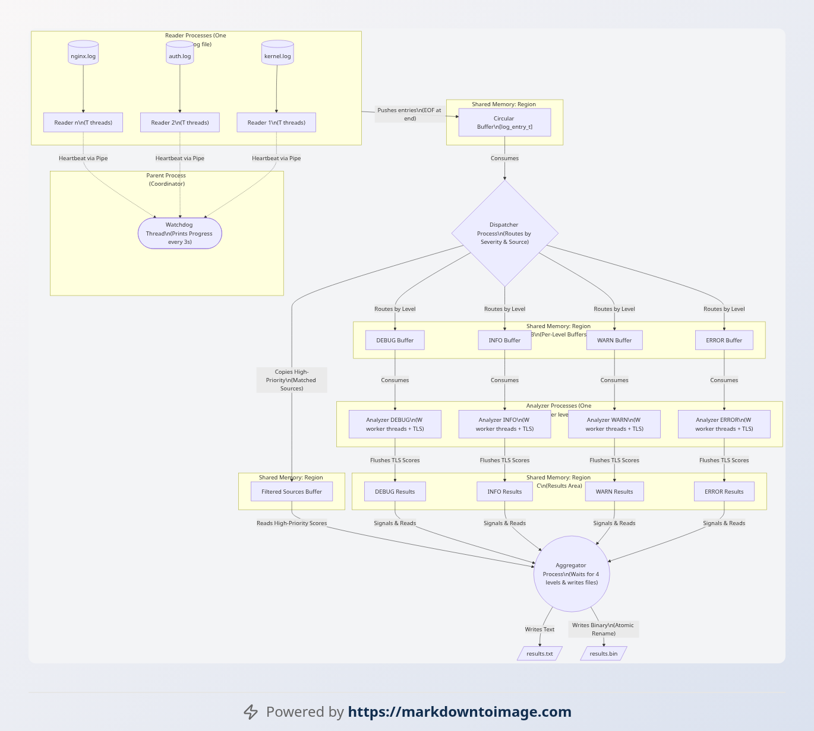

# HW4 — Multi-Process Concurrent Log Analyzer

A multi-process pipeline system that concurrently reads, analyzes, aggregates, and dispatches results from multiple log files using POSIX shared memory and semaphores.

## Architecture

```
Main Process (Orchestrator)
├── Reader Processes (N)      → Read log files, load into shared memory
├── Analyzer Processes (N)    → Search log entries for keyword matches
├── Aggregator Process (1)    → Collect and merge results from analyzers
├── Dispatcher Process (1)    → Output final aggregated reports
└── Watchdog Process (1)      → Monitor child process health
```



## Key Concepts

| Concept | Implementation |
|---|---|
| **IPC** | POSIX shared memory (`shm_open`, `mmap`) |
| **Synchronization** | POSIX named semaphores (`sem_open`) |
| **Concurrency** | `fork()` — multiple child processes |
| **Signal Handling** | `SIGINT`, `SIGCHLD`, `SIGTERM` for graceful shutdown |

## Files

| File | Description |
|---|---|
| `main.c` | Entry point, argument parsing, process orchestration |
| `reader.c` / `reader.h` | Log file reading processes |
| `analyzer.c` / `analyzer.h` | Log entry analysis (keyword matching) |
| `aggregator.c` / `aggregator.h` | Result aggregation across analyzers |
| `dispatcher.c` / `dispatcher.h` | Final result reporting |
| `watchdog.c` / `watchdog.h` | Child process health monitor |
| `shm.c` / `shm.h` | Shared memory & semaphore management |
| `mac_compat.h` | macOS compatibility layer |
| `Makefile` | Build configuration |
| `services.conf` | Service/log file configuration |
| `priority.txt` | Keyword priority definitions |

## Build & Run

```bash
make
./analyzer -d <logDir> -f services.conf -k "error,warning,fail" -t 4 -p priority.txt
```

### Arguments

| Flag | Description |
|---|---|
| `-d` | Directory containing log files |
| `-f` | Service config file listing log file names |
| `-k` | Comma-separated keywords to search |
| `-t` | Number of concurrent reader/analyzer processes |
| `-p` | Keyword priority file |

## System Calls Used

`fork()`, `waitpid()`, `shm_open()`, `mmap()`, `sem_open()`, `sem_wait()`, `sem_post()`, `sigaction()`, `kill()`, `fopen()`, `opendir()`, `readdir()`
